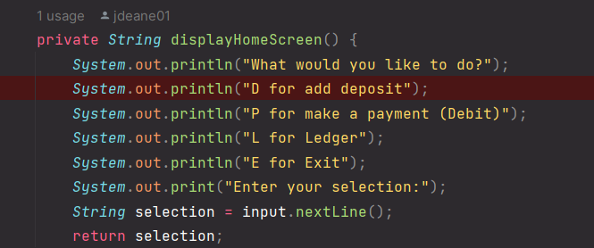
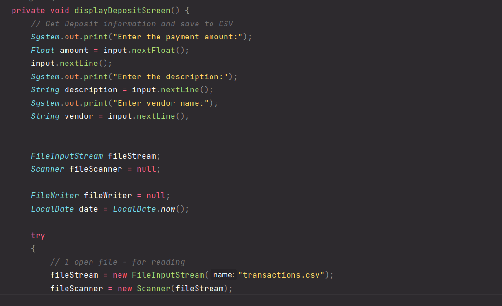
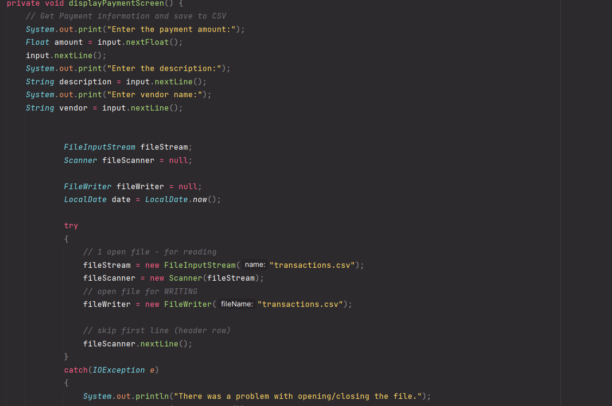
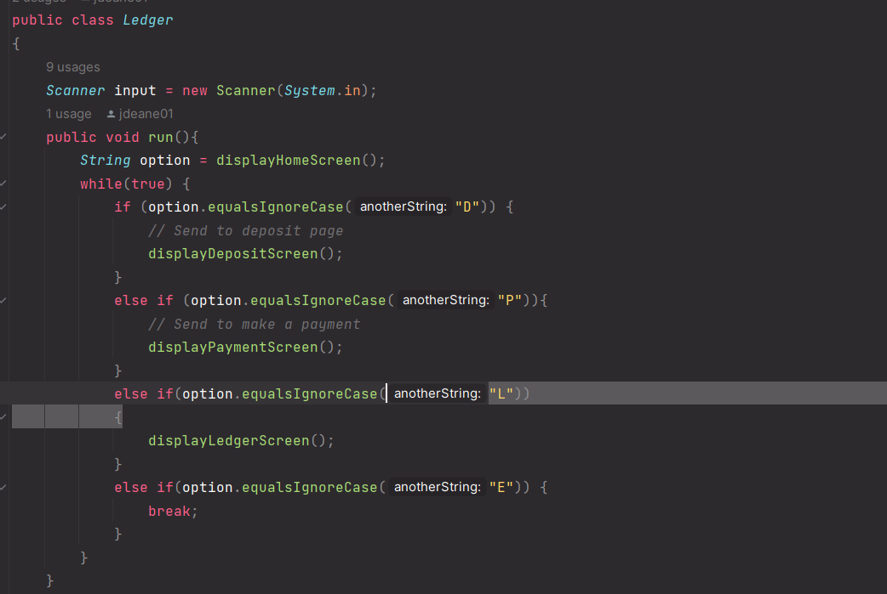

# AccountingLedger

Project Overview: Accounting ledger with multiple screens.

 Screen one
 Screen two
 Screen three

An Interesting code in this project is the screen options loops exampled in image. 

I originally started the project and realized early that I needed to restart. After restarting my project I focused on a skeleton based approach.
Commenting out and planning what I want to do and then filling in as I went along. The delay limited my progress but overall the project was a great learning experience.

I learned a faster way to set up Constructors, Getters/Setters, utilizing the Generate function (ALT + INSERT).

Having went into the project unsure on what an Accounting Ledger is and restarting completely, I'm satisfied with the formatting of my code and the progress I've made so far.
This was a solo project and as a complete beginner there were times I doubted myself. I knew I wouldn't be able to 100% complete the project but my goal was to attempt to and to make sure what I do have is correct.
I look forward to future capstone projects solo/group to demonstrate more growth.

:)